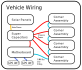

# Electrical

Acorn's electrical system can broadly be described as a motherboard
communicating with four corner assemblies using [CAN bus](https://en.wikipedia.org/wiki/CAN_bus).

 

## Chassis Wiring

We use a custom data cable system with two CAN bus circuits and a special
emergency stop system, plus a second set of cables to carry power. One CAN bus
circuit is used specifically for our motor controllers, while the other circuit
is available for general use.

Power cables are generally 12 gauge silicone jacketed wire terminated with
Anderson PP45 crimp connectors. We use [this wire specifically](https://bntechgo.com/bntechgo-12-gauge-silicone-wire-spool-50-feet-25-ft-black-and-25-ft-red-ultra-flexible-high-temp-200-deg-c-600v/).

The data cable system uses 8 pin "M12" connectors and cables commonly used in
industrial ethernet. We use the A-code mating style as opposed to X-code. For
PCB mount connectors we use M12A-08PFFR-SF7003, for cables we use something
like M12A08ML-12AML-SD002 or M12A08ML-12AFL-SB002.

1 ESTOP SWITCH CIRCUIT  
2 CAN 1 HIGH  
3 CAN 1 LOW  
4 ISOLATED GROUND  
5 CAN 0 HIGH  
6 ESTOP SQUARE WAVE  
7 ISOLATED FIVE VOLT  
8 CAN 0 LOW  

## Circuit Boards

Acorn relies on an extensive set of custom circuit boards. The two most
important boards are the motherboard and the motor controller, with other boards
supporting these in a few ways.

Anyone can order our PCBs through JLCPCB using the files from our github, but
this is not advised until our PCB designs have matured. In the future we will
publish official PCB releases, to make ordering them easier for users.

#### Motherboard

Holds the main computer, a Raspberry Pi Compute Module 4, and communicates
with the four motor controllers using CAN bus. Also manages GPS, wifi, emergency
stop system, and several other functions.  
https://github.com/Twisted-Fields/acorn-robot-electronics/tree/main/cm4_robot_board  

For more information see {doc}`pcb/motherboard`

#### Motor Controller

Made up of three PCBs. Motor Driver Module, CPU Base, and User Interface.
The driver module holds the MOSFETS and related power driver circuitry to drive
a motor. Nominally rated at 53 volts, 20A continuous (depending on thermals),
50A peak. The CPU Base holds two motor driver modules and contains two RP2040
CPUs. One CPU handles all motor driving functions, while the other handles CAN
bus communications and other auxiliary functions. Both PCBs can be reflashed
over CAN bus using our firmware flashing scripts. The User Interface PCB
attaches to the CPU Base PCB and features several buttons, switches, and LEDs
as well as room for an OLED display. This is used to control the corner
assembly.  
https://github.com/Twisted-Fields/rp2040-motor-controller/

#### Induction Encoder

Our round induction encoder PCB is used to sense the steering angle in the
corner assembly. It is a large ring-shaped PCB with a special coil pattern
and an IPS2200 induction encoder chip, plus 8 evenly spaced analog magnetic
field sensors. Three ADS1115 I2C ADCs read these sensors. The PCB communicates
with the motor controller using I2C over the motor controller encoder ports.
The induction section uses two phases, and the magnetic sensors detect a magnet
in the steering gear which disambiguates the phases. The PCB is partially
generated with a python script also present in the git repo.  
https://github.com/Twisted-Fields/induction_encoder

#### Magnetic Angle Encoder

An on-axis magnetic angle encoder. Designed to be used as an angle sensor on
hobby-style brushless motors for use with our motor controller. Not presently
used on our robot, but important to know it is available for use with
supporting code.  
https://github.com/Twisted-Fields/rp2040-motor-controller/tree/main/rp2040_encoder

#### RP2040 Debugger PCB

A custom debugger PCB for our RP2040 board. Designed before the official
debugger was available, but features our larger and more rugged molex debug
connector, USB-C, and lots of good vibes. The design has now been updated to
match the official debugger schematic (excluding level shifting buffers).  
https://github.com/Twisted-Fields/rp2040-motor-controller/tree/main/debugger

#### Mag Sensor

A single analog magnetic field strength sensor PCB is available for custom
end stop sensing when building tools or other machinery with our system. This
board mates to the CPU Base PCB of the motor controller.  
https://github.com/Twisted-Fields/acorn-robot-electronics/tree/main/mag_sensor

#### Supercap balance and fuse PCB

This PCB is still under development, but will balance the supercaps and provide
some sort of safety fuse or current based shut-off of power if there is a short
on the system power leads. One version of that board is here:  
https://github.com/Twisted-Fields/acorn-robot-electronics/tree/main/supercap/supercap

#### Camera system PCB

In the future we will build a camera system for Acorn that will probably feature
a Raspberry Pi CM5 compute module, two Starlight Eye open source cameras, an
opto-isolated shutter sync circuit, and power supplies. One module could be
mounted in each corner of Acorn with one facing outward and one facing inward,
for a total of four external navigation cameras and four crop vision cameras.
Cameras could also be mounted as overlapping stereo pairs.
See the open source StarlightEye camera here:  
https://github.com/will127534/StarlightEye  
See also the One Inch Eye here:  
https://github.com/will127534/OneInchEye  
The large pixels of these sensors offer considerable advantages over standard
Raspberry Pi camera modules, but sensor availability may be an issue.
