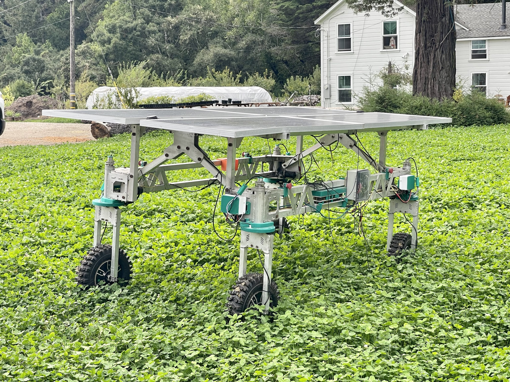
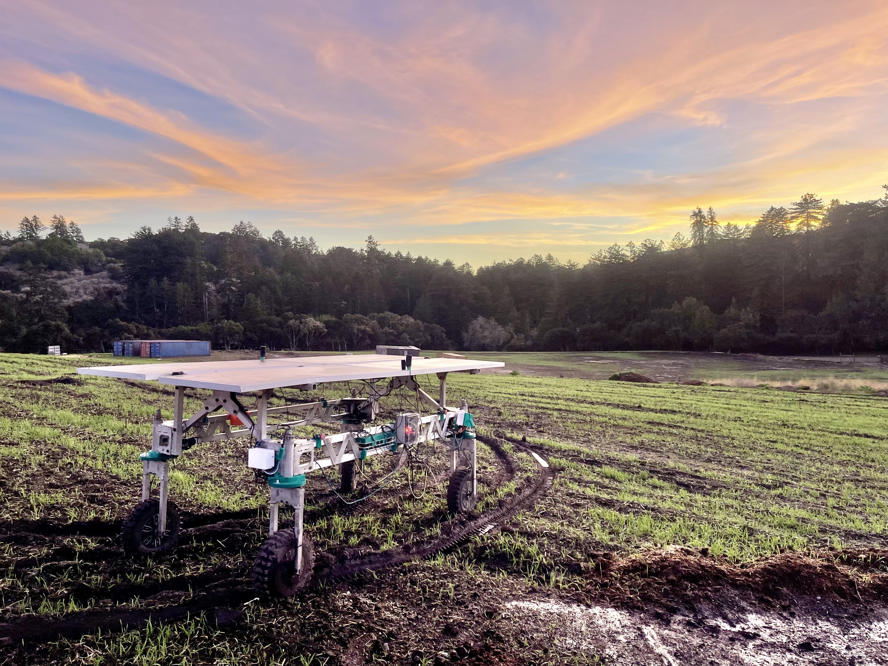

# Welcome to Twisted Fields' documentation!

We're creating Acorn, our open source Precision Farming Rover.



[Twisted Fields](https://www.twistedfields.com/) is a research farm located in
San Gregorio, California, just outside of Silicon Valley and San Francisco.

Check out the {doc}`overview` section for an overview of how the system works.

See also [our community discussion page](https://community.twistedfields.com/) for active discussion of this project. View [our youtube channel](https://www.youtube.com/@twistedfields) for status updates on the project and additional information, and see all of our open source materials directly on [our github page](https://github.com/Twisted-Fields/).

:::{note}
This project is under active development.
:::

## Contents

```{toctree}
overview
software
electrical
mechanical
corner
frame
materials
pcb/motherboard
pcb/motor_controller
about
```


