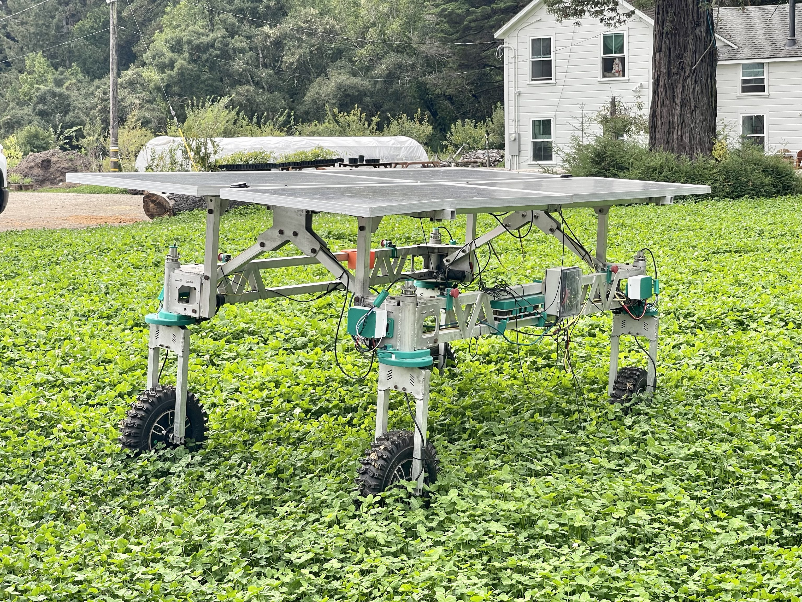
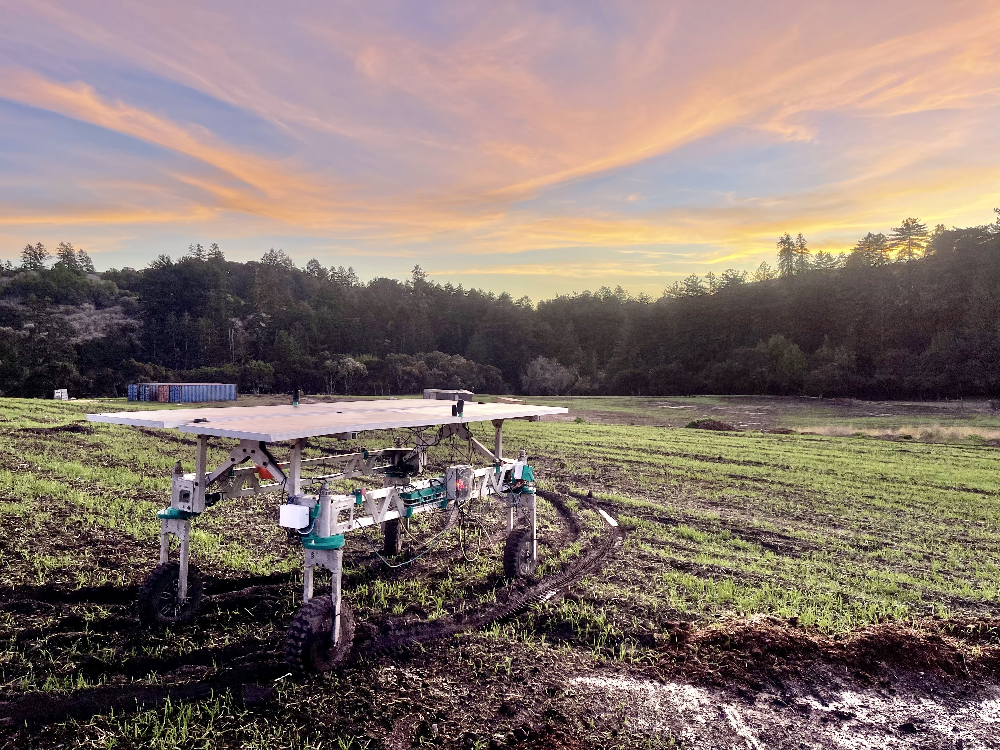

Welcome to Twisted Fields' documentation!
===================================

We're creating Acorn, our open source Precision Farming Rover.

`Twisted Fields <https://www.twistedfields.com/>`_ is a research farm located in
San Gregorio, California, just outside of Silicon Valley and San Francisco.

Check out the :doc:`overview` section for an overview of how the system works.

See also `our community discussion page <https://community.twistedfields.com/>`_
for active discussion of this project. View `our youtube channel <https://www.youtube.com/@twistedfields>`_
for status updates on the project and additional information, and see all of
our open source materials directly on `our github page <https://github.com/Twisted-Fields/>`_.

See the "Contents" section below for additional information.

.. note::

   This project is under active development.

Contents
--------

.. toctree::

   overview
   software
   electrical
   mechanical

