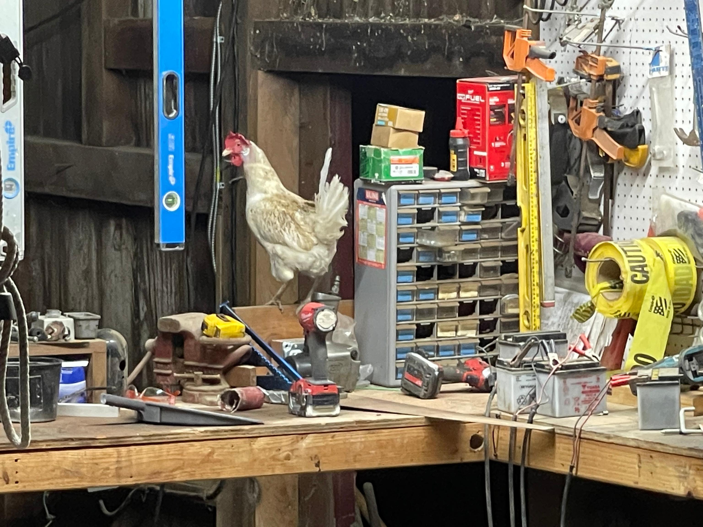

# Bill of Materials

 

## Configurations

The robot can be built with a DIY frame and four corner assemblies, or as a
complete robot with aluminum frame.

## Complete Robot

Solar Panels x 4  
Chassis Wiring - data  
Chassis Wiring - power  
Corner Assemblies x4  
Super Capacitors  
Motherboard Assembly  
GPS Modules x 2 ([Source](https://www.sparkfun.com/products/16481))
GPS Antennas x 2 ([Source](https://www.sparkfun.com/products/23814))
Frame Side x 2  
Frame Front x 2  
Frame solar panel mounts

## Corner Assembly

Motor controller PCB assembly with UI PCB  
\$100  
Induction encoder PCB  
\$20  

Aluminum fork upper weldment  
Aluminum fork lower weldment  
Thrust bearings  
3D printed steel steering drive gear  
Drive motor phase and hall cable  
Steering motor phase cable  
Induction encoder interface cable  

##### Drive Motor

[Supplier URL](https://ebikes.ca/geared-wheelbarrow-motor.html)  
$275.00  
This motor is generally pretty good, but it may not be weatherproof enough.
May need to order a custom motor, but suppliers we have contacted have not
wanted to make a motor with the high gear ratio reduction of this wheelbarrow
motor. Bafang requires a 500 piece order to custom make a motor. It may be possible
to convince Bafang that the world needs a robust electric farm robot wheel which
supports larger diameter tires, better weather sealing, and planetary gearing.
Or someone on the ground in China may be able to find a manufacturer which can
support our needs. So far efforts to do so over Alibaba have failed.

##### Tires

Carlisle X Trac ATV Bias Tire - 4.80-8
$40  
[Amazon link](https://www.amazon.com/gp/product/B001THKFKI/)

##### Steering Motor

AM Equipment AMP240-0502  
[Supplier URL](https://www.amequipment.com/shop/240-series-standard-industrial-dc-gear-motor/)  
\$300 - We no longer need the built-in encoder, so a cheaper weather sealed
motor should be found, or a non-sealed motor plus enclosure should be tested.

Something in the 60 RPM range similar to these \$45 aliexpress motors could be
viable:  
[Aliexpress URL](https://www.aliexpress.us/item/3256805726245085.html)  
Warning these shippers seem slow and unreliable. A reliable supplier would
need to be found, if testing showed the motors to be of acceptable performance.
These motors may be under powered - needs testing.
