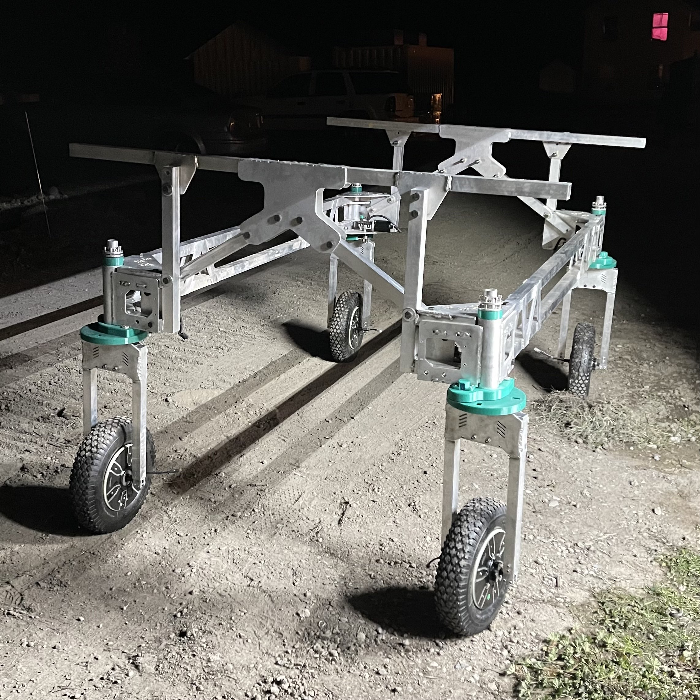

# Mechanical

Acorn uses a MIG welded aluminum frame built from aluminum tubes and CNC plasma
cut aluminum plate. With a little practice and careful study of free welding
tutorial videos online, anyone can learn aluminum MIG welding.

 

See also {doc}`frame`

## Equipment Required

Note that plasma cut parts flat pack nicely, so the CNC plasma cutter, the most
expensive tool, could be omitted if one wanted to source those parts from an
outside shop.

Major tools:

- 3D printer      \$1000
- welder           \$500
- plasma cutter   \$8000
- drill press      \$200
- bench grinder    \$200
- welding table    \$200

Other useful tools:

- Metal files
- Drill bits
- Orbital sander
- Screwdrivers
- Wrenches

## Locating design files

The design files are in onshape, a free cloud based CAD program. As of mid-2024, the mechanical designs are highly in flux, and the mechanical design folder structure has not been organized. By the end of 2024, our mechanical designs should be stabilized, and design released will be created. When that occurs, the design files will be organized. For now, feel free to browse the design files as a reference. More information is available here:

[GitHub - Twisted-Fields/acorn-mechanical-designs](https://github.com/Twisted-Fields/acorn-mechanical-designs)
