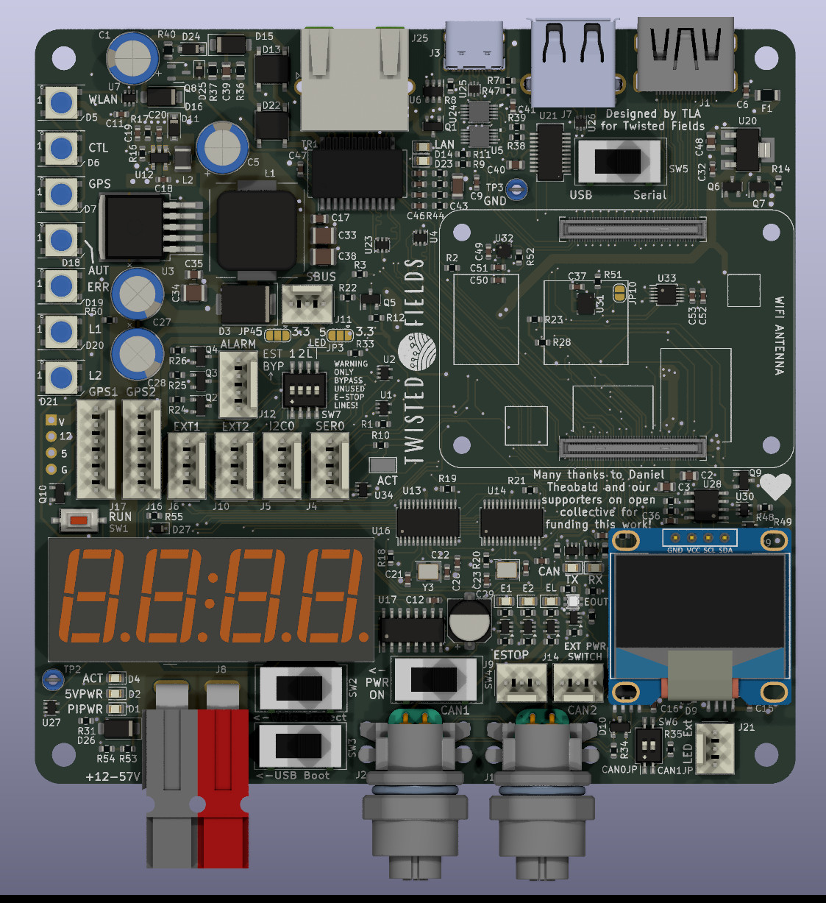

# Motherboard

Holds the main computer, a Raspberry Pi Compute Module 4, and communicates
with the four motor controllers using CAN bus. Also manages GPS, wifi, emergency
stop system, and several other functions.  

 
