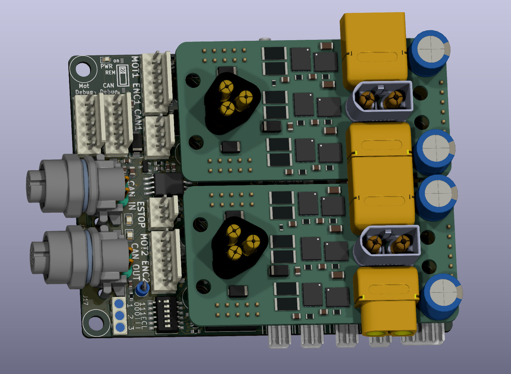

# Motor Controller

Made up of three PCBs. Motor Driver Module, CPU Base, and User Interface.
The driver module holds the MOSFETS and related power driver circuitry to drive
a motor. Nominally rated at 53 volts, 20A continuous (depending on thermals),
50A peak. The CPU Base holds two motor driver modules and contains two RP2040
CPUs. One CPU handles all motor driving functions, while the other handles CAN
bus communications and other auxiliary functions. Both PCBs can be reflashed
over CAN bus using our firmware flashing scripts. The User Interface PCB
attaches to the CPU Base PCB and features several buttons, switches, and LEDs
as well as room for an OLED display. This is used to control the corner
assembly.  

 
