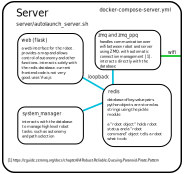
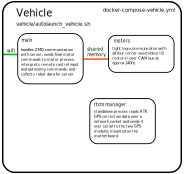

# Software

Our software is primarily written in python, with embedded system software
written in C++.

The python code can be logically separated in to "vehicle" and "server" code.
The server code is typically run on a separate machine, though it can be run on
robot.

 

 
